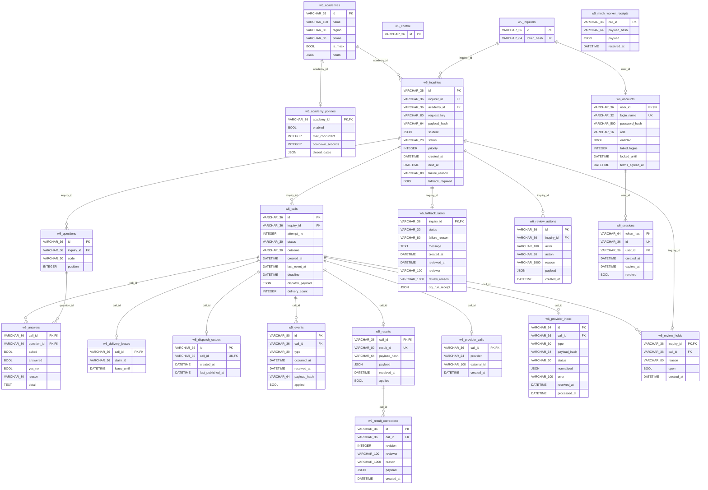

# 백엔드 ERD

```mermaid
erDiagram
    w5_academies {
        VARCHAR_36 id PK
        VARCHAR_100 name
        VARCHAR_80 region
        VARCHAR_30 phone
        BOOL is_mock
        JSON hours
    }
    w5_control {
        VARCHAR_36 id PK
    }
    w5_inquirers {
        VARCHAR_36 id PK
        VARCHAR_64 token_hash UK
    }
    w5_mock_worker_receipts {
        VARCHAR_36 call_id PK
        VARCHAR_64 payload_hash
        JSON payload
        DATETIME received_at
    }
    w5_academy_policies {
        VARCHAR_36 academy_id PK,FK
        BOOL enabled
        INTEGER max_concurrent
        INTEGER cooldown_seconds
        JSON closed_dates
    }
    w5_academies ||--o| w5_academy_policies : "academy_id"
    w5_inquiries {
        VARCHAR_36 id PK
        VARCHAR_36 inquirer_id FK
        VARCHAR_36 academy_id FK
        VARCHAR_80 request_key
        VARCHAR_64 payload_hash
        JSON student
        VARCHAR_20 status
        INTEGER priority
        DATETIME created_at
        DATETIME next_at
        VARCHAR_80 failure_reason
        BOOL fallback_required
    }
    w5_academies ||--o{ w5_inquiries : "academy_id"
    w5_inquirers ||--o{ w5_inquiries : "inquirer_id"
    w6_accounts {
        VARCHAR_36 user_id PK,FK
        VARCHAR_32 login_name UK
        VARCHAR_500 password_hash
        VARCHAR_16 role
        BOOL enabled
        INTEGER failed_logins
        DATETIME locked_until
        DATETIME terms_agreed_at
    }
    w5_inquirers ||--o| w6_accounts : "user_id"
    w5_calls {
        VARCHAR_36 id PK
        VARCHAR_36 inquiry_id FK
        INTEGER attempt_no
        VARCHAR_30 status
        VARCHAR_30 outcome
        DATETIME created_at
        DATETIME last_event_at
        DATETIME deadline
        JSON dispatch_payload
        INTEGER delivery_count
    }
    w5_inquiries ||--o{ w5_calls : "inquiry_id"
    w5_questions {
        VARCHAR_36 id PK
        VARCHAR_36 inquiry_id FK
        VARCHAR_30 code
        INTEGER position
    }
    w5_inquiries ||--o{ w5_questions : "inquiry_id"
    w6_fallback_tasks {
        VARCHAR_36 inquiry_id PK,FK
        VARCHAR_30 status
        VARCHAR_80 failure_reason
        TEXT message
        DATETIME created_at
        DATETIME reviewed_at
        VARCHAR_100 reviewer
        VARCHAR_1000 review_reason
        JSON dry_run_receipt
    }
    w5_inquiries ||--o| w6_fallback_tasks : "inquiry_id"
    w6_review_actions {
        VARCHAR_36 id PK
        VARCHAR_36 inquiry_id FK
        VARCHAR_100 actor
        VARCHAR_30 action
        VARCHAR_1000 reason
        JSON payload
        DATETIME created_at
    }
    w5_inquiries ||--o{ w6_review_actions : "inquiry_id"
    w6_sessions {
        VARCHAR_64 token_hash PK
        VARCHAR_36 id UK
        VARCHAR_36 user_id FK
        DATETIME created_at
        DATETIME expires_at
        BOOL revoked
    }
    w6_accounts ||--o{ w6_sessions : "user_id"
    w5_answers {
        VARCHAR_36 call_id PK,FK
        VARCHAR_36 question_id PK,FK
        BOOL asked
        BOOL answered
        BOOL yes_no
        VARCHAR_30 reason
        TEXT detail
    }
    w5_calls ||--o{ w5_answers : "call_id"
    w5_questions ||--o{ w5_answers : "question_id"
    w5_delivery_leases {
        VARCHAR_36 call_id PK,FK
        VARCHAR_36 claim_id
        DATETIME lease_until
    }
    w5_calls ||--o| w5_delivery_leases : "call_id"
    w5_dispatch_outbox {
        VARCHAR_36 id PK
        VARCHAR_36 call_id UK,FK
        DATETIME created_at
        DATETIME last_published_at
    }
    w5_calls ||--o| w5_dispatch_outbox : "call_id"
    w5_events {
        VARCHAR_80 id PK
        VARCHAR_36 call_id FK
        VARCHAR_30 type
        DATETIME occurred_at
        DATETIME received_at
        VARCHAR_64 payload_hash
        BOOL applied
    }
    w5_calls ||--o{ w5_events : "call_id"
    w5_results {
        VARCHAR_36 call_id PK,FK
        VARCHAR_80 result_id UK
        VARCHAR_64 payload_hash
        JSON payload
        DATETIME received_at
        BOOL applied
    }
    w5_calls ||--o| w5_results : "call_id"
    w6_provider_calls {
        VARCHAR_36 call_id PK,FK
        VARCHAR_24 provider
        VARCHAR_100 external_id
        DATETIME created_at
    }
    w5_calls ||--o| w6_provider_calls : "call_id"
    w6_provider_inbox {
        VARCHAR_64 id PK
        VARCHAR_36 call_id FK
        VARCHAR_60 type
        VARCHAR_64 payload_hash
        VARCHAR_30 status
        JSON normalized
        VARCHAR_100 error
        DATETIME received_at
        DATETIME processed_at
    }
    w5_calls ||--o{ w6_provider_inbox : "call_id"
    w6_review_holds {
        VARCHAR_36 inquiry_id PK,FK
        VARCHAR_36 call_id FK
        VARCHAR_80 reason
        BOOL open
        DATETIME created_at
    }
    w5_calls ||--o{ w6_review_holds : "call_id"
    w5_inquiries ||--o| w6_review_holds : "inquiry_id"
    w5_result_corrections {
        VARCHAR_36 id PK
        VARCHAR_36 call_id FK
        INTEGER revision
        VARCHAR_100 reviewer
        VARCHAR_1000 reason
        JSON payload
        DATETIME created_at
    }
    w5_results ||--o{ w5_result_corrections : "call_id"
```
